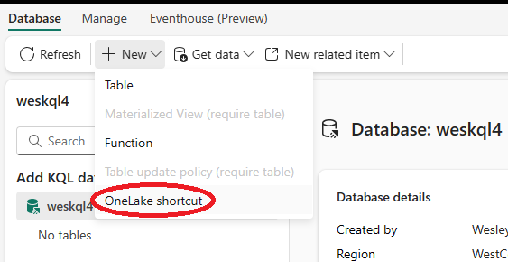
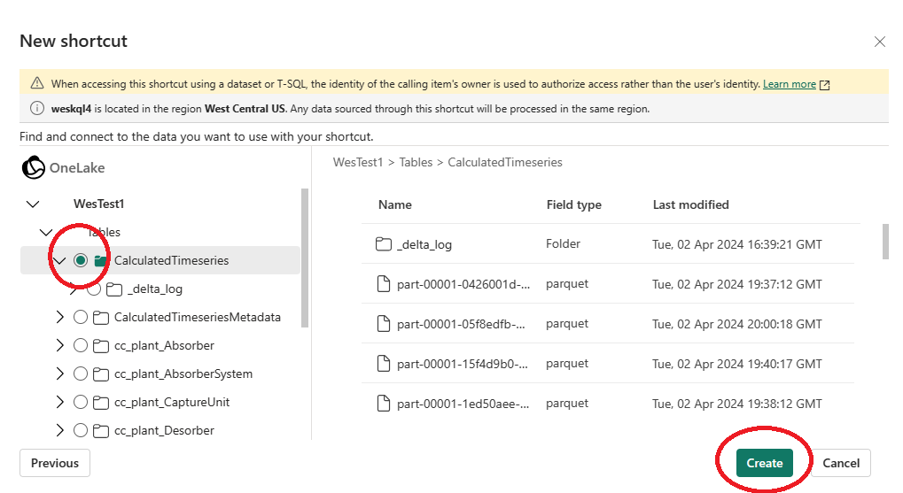
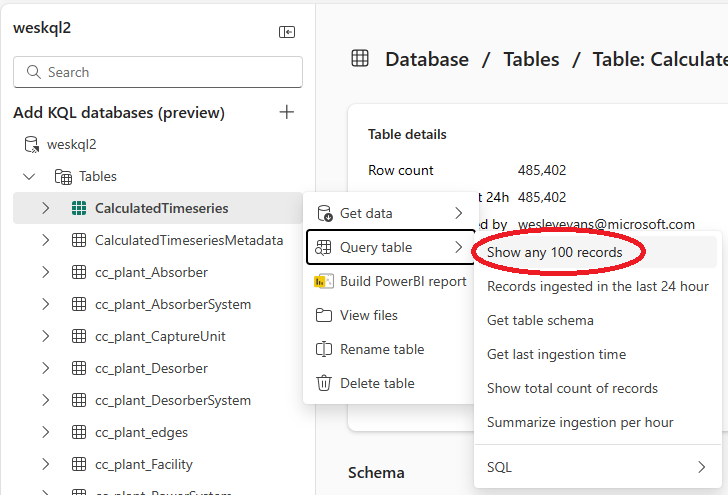

# Syncing data between Fabric Lakehouse and Fabric KQL

## Backgroud

The CDF Fabric Replicator copies data into a [Fabric Lakehouse](https://learn.microsoft.com/en-us/fabric/data-engineering/lakehouse-overview) in [Delta Lake](https://delta.io/) format. This allows for querying data in Power Bi. However, in order to use [Real-Time Analytics](https://learn.microsoft.com/en-us/fabric/real-time-analytics/overview), your data must be in a Fabric KQL database. The following instructions demonstrate how to create a shortcut to get data from a Fabric Lakehouse into Fabric KQL.

## Prerequisites 
* Fabric workspace
* Fabric Lakehouse populated by CDF Fabric Replicator

## Setup shortcut
1. Open your Fabric workspace
2. Select New -> More options -> KQL Database
3. Choose a new name and press "Create"
4. From KQL database, click on the dropdown next to "New" and click "OneLake shortcut"

5. Choose Internal source -> Microsoft OneLake
6. Select the name of your Lakehouse and hit "Next"
7. Select the name of your table and hit "Next"

8. Expand Shortcuts, Right-click on your table, choose Query table -> Show any 100 records

9. Validate data is in KQL
10. Repeat steps 4 to 9 for each additional table