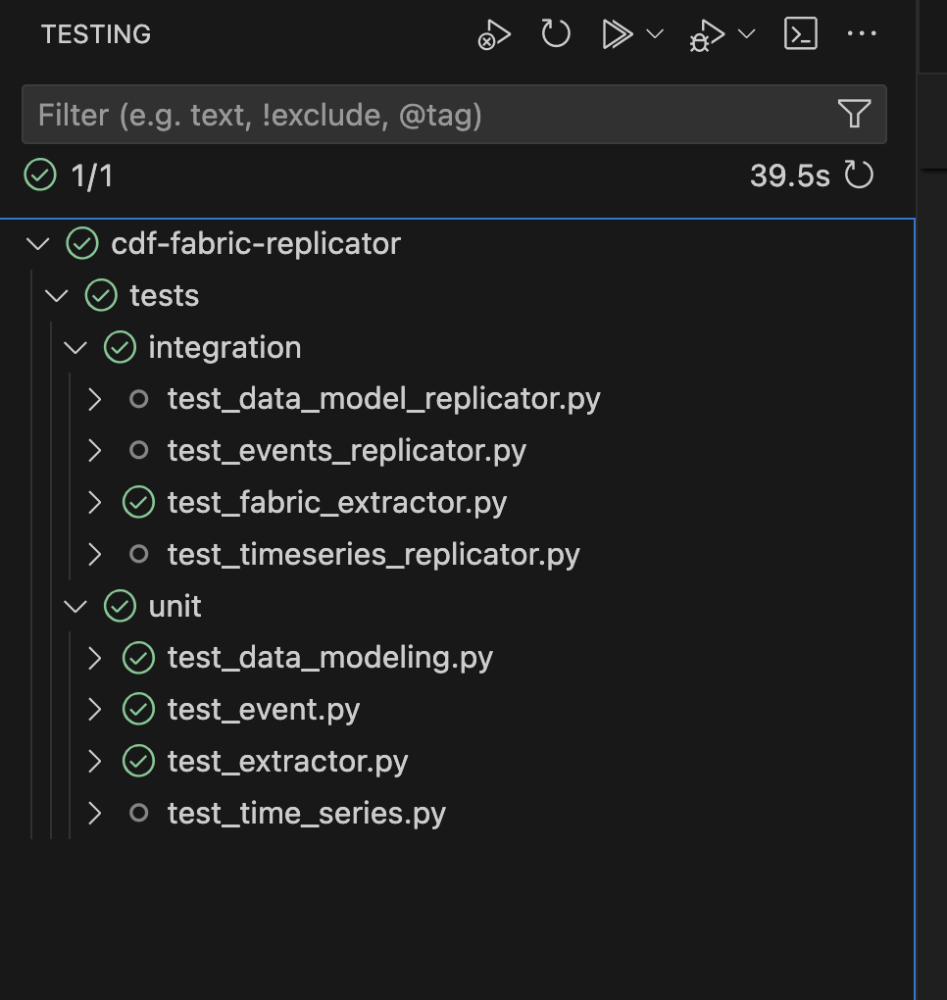

# CDF Fabric replicator

The **CDF Fabric replicator** utilizes the **Cognite Data Fusion** (CDF) APIs to replicate data to and from **Microsoft Fabric** (Fabric).

The replicator consists of four services:
- **Time series replicator** - Copies time series data from CDF to Fabric.
- **Data model replicator** - Copies data model nodes and edges from CDF to Fabric.
- **Event replicator** - Copies event data from CDF to Fabric.
- **Fabric data extractor** - Copies time series, events, and files from Fabric to CDF.

All four services will run concurrently during the execution of the CDF Fabric Replicator program. The services use one state store in CDF's raw storage to maintain checkpoints of when the latest data was copied, so the services can be started and stopped and will be able to pick back up where they left off.

## Table of Contents
- [Local Development with CDF Fabric replicator](#local-development-with-cdf-fabric-replicator)
- [Setting up Data Point Subscriptions](#setting-up-data-point-subscriptions)
- [Environment Variables](#environment-variables)
  - [CDF Variables](#cdf-variables)
  - [Fabric Variables](#fabric-variables)
  - [Fabric Extractor Variables](#fabric-extractor-variables)
  - [Integration Test Variables](#integration-test-variables)
- [Config YAML](#config-yaml)
  - [Remote config](#remote-config)
- [Running with Poetry](#running-with-poetry)
  - [Command-line](#command-line)
  - [Visual Studio Code](#visual-studio-code)
- [Building and Deploying with Docker on AKS](#building-and-deploying-with-docker-on-aks)
  - [Pre-requisites](#pre-requisites)
  - [Use helm to deploy your container to AKS](#use-helm-to-deploy-your-container-to-aks)
  - [Running test_helm_chart_deployment Test](#running-test_helm_chart_deployment-test)
- [Testing](#testing)
  - [Setting Up Tests](#setting-up-tests)
  - [Github Action](#github-action)
  - [Best Practices for Adding Tests](#best-practices-for-adding-tests)

## Local Development with CDF Fabric replicator
Follow these instructions for doing Local Development with CDF Fabric replicator:
1. Clone repo: `git clone https://github.com/cognitedata/cdf-fabric-replicator.git`
2. Install Python (3.10, 3.11, or 3.12).
3. Install [Poetry](https://python-poetry.org/docs/#installation).
    > Note: Poetry should be installed in a virtual environment, see the [installation instructions](https://python-poetry.org/docs/#installation) for more details.
4. Setup [environment variables](#environment-variables) and [Config file](#config-yaml) to point to your data source and destination.
5. At this point, you need to install your project dependencies and run the application. You can either do that from the [command-line](#command-line) or from [Visual Studio Code](#visual-studio-code).

## Setting up Data Point Subscriptions

The time series replicator uses [data point subscriptions](https://cognite-sdk-python.readthedocs-hosted.com/en/latest/time_series.html#create-data-point-subscription) to get updates on incoming time series data. If only one subscription with a single partition is defined in the configuration file, then the subscription is created automatically by the Time Series Replicator, based on the values in the configuration file.

## Environment Variables

You can optionally copy the contents of `.env.example` to a `.env` file that will be used to set the values in a config yaml file:

### CDF Variables
- `COGNITE_BASE_URL`: The base URL of the Cognite project, i.e. https://<cluster_name>.cognitedata.com.
- `COGNITE_PROJECT`: The project ID of the Cognite project.
- `COGNITE_TOKEN_URL`: The URL to obtain the authentication token for the Cognite project, i.e. https://login.microsoftonline.com/<tenant_id>/oauth2/v2.0/token.
- `COGNITE_CLIENT_ID`: The client ID for authentication with the Cognite project.
- `COGNITE_CLIENT_SECRET`: The client secret for authentication with the Cognite project.
- `COGNITE_STATE_DB`: The database in CDF raw storage where the replicator state should be stored.
- `COGNITE_STATE_TABLE`: The table in CDF raw storage where the replicator state should be stored. The replicator will create the table if it does not exist.
- `COGNITE_EXTRACTION_PIPELINE`: The extractor pipeline in CDF for the replicator. [Learn more about configuring extractors remotely](https://docs.cognite.com/cdf/integration/guides/interfaces/configure_integrations).

### Fabric Variables
- `LAKEHOUSE_ABFSS_PREFIX`: The prefix for the Azure Blob File System Storage (ABFSS) path. Should match pattern `abfss://<workspace_id>@msit-onelake.dfs.fabric.microsoft.com/<lakehouse_id>`. Get this value by selecting "Properties" on your Lakehouse Tables location and copying "ABFSS path".
- `DPS_TABLE_NAME`: The name of the table where data point values and timestamps should be stored in Fabric. The replicator will create the table if it does not exist.
- `TS_TABLE_NAME`: The name of the table where time series metadata should be stored in Fabric. The replicator will create the table if it does not exist.
- `EVENT_TABLE_NAME`: The name of the table where event data should be stored in Fabric. The replicator will create the table if it does not exist.

### Fabric Extractor Variables
- `EXTRACTOR_EVENT_PATH`: The table path for the events table in a Fabric lakehouse. It's the relative path after the ABFSS prefix (e.g. "Tables/RawEvents").
- `EXTRACTOR_FILE_PATH`: The single file path or directory of the files in a Fabric lakehouse. It's the relative path after the ABFSS prefix (e.g. "Files" or "Files/Tanks.png").
- `EXTRACTOR_RAW_TS_PATH`: The file path for the raw timeseries table in a Fabric lakehouse. It's the relative path after the ABFSS prefix (e.g. "Tables/RawTS").
- `EXTRACTOR_DATASET_ID`: Specifies the ID of the extractor dataset when the data lands in CDF.
- `EXTRACTOR_TS_PREFIX`: Specifies the prefix for the extractor timeseries when the data lands in CDF.

### Integration Test Variables
- `TEST_CONFIG_PATH`: Specifies the path to the test configuration file with which test versions of the replicator are configured.

## Config YAML
The replicator reads its configuration from a YAML file specified in the run command. You can configure your own YAML file based on the one in [example_config.yaml](example_config.yaml) in the repo. That configuration file uses the environment variables in `.env`, the configuration can also be set using hard-coded values.

`subscriptions` and `data_modeling` configurations are a list, so you can configure multiple data point subscriptions or data modeling spaces to replicate into Fabric.

### Remote config
The [example_config.yaml](example_config.yaml) contains all configuration required to run the replicator. Alternatively [config_remote.yaml](build/config_remote.yaml) is provided to point to an Extraction Pipeline within a CDF project that contains the full configuration file. This allows a Docker image to be built and deployed with a minimal configuration, and lets you make changes to the full configuration without rebuilding the image.

## Running with Poetry

To run the `cdf_fabric_replicator` application, you can use Poetry, a dependency management and packaging tool for Python.

First, make sure you have Poetry installed on your system. If not, you can install it by following the instructions in the [Poetry documentation](https://python-poetry.org/docs/#installation).

### Command-line

Once Poetry is installed, navigate to the root directory of your project in your terminal.

Next, run the following command to install the project dependencies:
```
poetry install
```

Finally, run the replicator:
```
poetry run cdf_fabric_replicator <name of config file>
```

### Visual Studio Code

Alternatively, if you are using Visual Studio Code, just open the folder of the root directory of your project.

You must still install Poetry as mentioned above in addition to the [Python Extension](https://marketplace.visualstudio.com/items?itemName=ms-python.python) for VSCode.

The included ".vscode/launch.json" file will add the following two launch actions to your debug menu:

- poetry install - Run this the first time you start your code to install dependencies into the Poetry virtual environment
- poetry run - Run this after the dependencies are installed. It will start your project with an attached debugger. For more information see [Debugging in Visual Studio Code](https://code.visualstudio.com/Docs/editor/debugging).

## Building and Deploying with Docker on AKS

### Pre-requisites

#### Set Target Platform Architecture

If you are running the Docker Container on ARM Architecture, you will need to use platform emulation for the Docker run command. You can do this by running the following command:

```
docker run -i -t <image-name> --platform linux/arm64 
```

#### Creating an AKS Cluster with Managed Identity

Azure Kubernetes Service (AKS) can use Azure Managed Identities to interact with other Azure services. This eliminates the need to manage service principals and rotate credentials. The Fabric Replicator requires managed identity on AKS to be enabled to run.

To create an AKS cluster with Managed Identity and an attached ACR, you can use the Azure CLI:

```bash
az aks create -g MyResourceGroup -n MyManagedCluster --generate-ssh-keys --attach-acr MyACR --enable-managed-identity
```

#### Build Docker to Push to ACR

Note: When you build the CDF Fabric Replicator from docker, the docker image is configured to use the config located in the Extraction Pipeline in CDF. You will need to configure the yaml file in the Extraction Pipeline in CDF.

First, you should build your your docker image locally:

```bash
docker build -t <MyImageName> -f ./build/Dockerfile . 
```

Before you can push an image to your ACR, you need to tag it with the login server name of your ACR instance:

```bash
docker tag <MyImageName>:latest <myregistry>.azurecr.io/<MyImageName>:latest
```

Next, log in to your ACR:

```bash
az acr login --name <myregistry>
```

Finally, push your image to your ACR instance:

```bash
docker push <myregistry>.azurecr.io/<MyImageName>:latest
```

Now, your Docker image is available in your ACR and can be pulled from your AKS cluster.

### Use helm to deploy your container to AKS

#### Configure values.yaml

The `values.yaml` file is a key part of your Helm chart as it allows you to set the default configuration values for the chart. These values can be overridden by users during installation or upgrade.

Here's a step-by-step guide on how to configure your `values.yaml` file:

1. Open the `values.yaml` file in your chart directory.

2. Set the default values for your chart. 

Some key values you need to fill out are:

##### Image Repository

```yaml
image:
  repository: <ACRREPOSITORYNAME>.azurecr.io/<IMAGENAME>
  pullPolicy: Always
  # Overrides the image tag whose default is the chart appVersion.
  tag: "latest"
```

##### Environment Variables
The environmental variables should be filled in with values that correspond to your CDF and Lakehouse environment, these allow the CDF Fabric Replicator to run.

```Yaml
env:
  COGNITE_TOKEN_URL: ""
  COGNITE_CLIENT_ID: ""
  COGNITE_CLIENT_SECRET: ""
  COGNITE_TOKEN_SCOPES: ""
  COGNITE_CLIENT_NAME: ""
  COGNITE_PROJECT: ""
  COGNITE_BASE_URL: ""
  COGNITE_STATE_TABLE: ""
  LAKEHOUSE_TIMESERIES_TABLE: TimeSeries
  LAKEHOUSE_ABFSS_PREFIX: ""
  EXTRACTOR_EVENT_PATH: "Tables/RawEvents"
  EXTRACTOR_FILE_PATH: ""
  EXTRACTOR_RAW_TS_PATH: "Tables/RawTS"
  EXTRACTOR_DATASET_ID: ""
  EXTRACTOR_TS_PREFIX: ""
  EXTRACTOR_DESTINATION_TYPE: ""
  EVENT_TABLE_NAME: ""
  COGNITE_STATE_DB: ""
  COGNITE_EXTRACTION_PIPELINE: ""
  ```

#### Connect to your AKS cluster

1. Login to your azure account:

    ```bash
    az login
    ```

2. Set the cluster subscription:

    ```bash
    az account set --subscription <Subscription ID>
    ```

3. Download cluster credentials

    ```bash
    az aks get-credentials --resource-group <RESOURCE GROUP> --name <ASK CLUSTER NAME> --overwrite-existing
    ```

#### Install Via Helm

To deploy your application to your Kubernetes cluster run the following command:

```bash
helm install <MYAppName> ./cdf-fabric-replicator-chart
```

To verify the status of your deployment run:

```bash
kubectl get pods
```

### Running test_helm_chart_deployment Test

`test_helm_chart_deployment` test is skipped when running integration tests as it requires an AKS cluster, and an container in ACR. The test uses Helm to deploy the image to AKS and checks that the status is running and runs for 1 minute without crashing. To run the test:

1. Remove `@pytest.mark.skip(reason="Skipping as this test requires an AKS cluster.")` from the top of the test.
2. Ensure your Docker image is build and pushed to an ACR
3. Ensure your AKS cluster is in and you are able to connect to it from your terminal.
4. Run `poetry run pytest tests/integration/test_helm.py -s` to run the test_helm_chart_deployment test.

## Testing
To maintain the quality and integrity of the `cdf-fabric-replicator` codebase, we have tests utilizing the [pytest](https://docs.pytest.org/en/8.2.x/) framework that run as part of the `test` Github Action.  There are two kinds of tests:
- **Unit** - Unit tests cover a single module or function in the code and do not require any external connections to run.  Unit test files are 1 to 1 with files under `cdf-fabric-replicator`.
- **Integration** - Integration tests cover interactions between modules as part of a service and connect to CDF and Fabric as part of the test.  Integration test files are 1 to 1 with the services of the `cdf-fabric-replicator` such as the Timeseries Replicator, Fabric Extractor, etc

### Setting Up Tests
***Before running tests, ensure you have a CDF project and a Fabric workspace dedicated for testing. The integration tests create and delete CDF objects and data and require a clean environment for accurate assertions.  You risk losing data if you run these tests in a dev/production environment.***

#### Environment Variables
Environment variables are not needed to run the unit tests, but are needed for the integration tests both to run locally and to run in the Github Action.

The environment variables for the tests are the same ones used for the replicator, with the addition of `TEST_CONFIG_PATH`, which is where the config file for the tests is located (in the repo, this file is under `tests/integration/test_config.yaml`).

Set your test environment variables in a `.env` file.  The integration tests will load the values from this file upon startup.

#### VS Code Test Explorer
Tests can run using the test explorer in VS Code.  To set up the test explorer, ensure you have the Python extension installed in VS Code and follow the instructions under [configure tests](https://code.visualstudio.com/docs/python/testing#_configure-tests) in the VS Code docs, configuring tests using the Pytest framework.  Your test setup should look like this:



Running tests using the explorer allows you to debug tests and easily manage which tests to run.  Ensure that the tests also run using `poetry` before pushing commits.
#### Poetry
`poetry` can be used to run the tests in addition to running the replicator itself.  Run all commands at the project root.  These are the important poetry commands to know:
- `poetry install` - Installs dependencies and sets configuration.  If a library is added or the coverage settings are modified this will need to be run.  `pytest` and `pytest_mock` are included in the `pyproject.toml`, so running an install will get your environment ready to run tests.
- `poetry run pytest <test_directory/>` - Runs all tests found under the test-directory path.  For example, to run just unit tests set test_directory to `tests/unit`.
- `poetry run coverage run -m pytest <test_directory/>`  - Runs the tests and creates a `.coverage` file that can be used to generate a report.
- `poetry run coverage report` - Shows the coverage report in the terminal.
A combination of the test run and coverage report is available as a VS Code launch configuration under `poetry test coverage`.

In the `pyproject.toml` file, there are configuration settings for the coverage, including the failure threshold and which files to exclude from coverage:
```
[tool.coverage.run]
omit = [".*", "*/tests/*"]
[tool.coverage.report]
fail_under = 90
```

### Github Action
The Github action runs the unit tests for both Python 3.10 and 3.11 using `poetry`.  This action will run for every pull request created for the repo.  *As integration tests are not part of the pull request actions, please ensure that the integration tests of the service related to your code changes passes successfully locally before making a PR.*

***Note: Integration tests will not pass for non-members of the `cdf-fabric-replicator` repository due to repository secret access for environment variables.***

### Best Practices for Adding Tests
- If a fixture can be shared across multiple tests, add it to the `conftest.py`.  Otherwise, keep fixtures that are specific to a single test in the test file.  For example, the Cognite SDK Client belongs in `conftest.py` as all the integration tests use it to seed test data.
- Ensure that coverage is at least 90% after any code additions.  Focus especially on unit test coverage as that helps ensure that all code paths are covered and any breaking changes can be isolated to the function where they occurred.
- Individual unit tests should not take longer than a second to run, excluding test collection.  Additionally, while integration tests take longer, pay attention to increases in test run times, as that may indicate that inefficient code was introduced.
- Limit mocks to external connections and complex functions that should be covered in separate tests.  For example, mock calls to the Cognite API using the client, but don't mock simple helper functions in the code.
- For unit tests, make sure the assertions that you add for function calls are useful.  For example, ensuring that the state store was synchronized after a data write is a useful assertion, whereas asserting that a helper method was called may become stale after a refactor.
- Add integration tests when a new feature or scenario is introduced to the codebase that wasn't captured in the integration tests before.  For example, add a test if a new data type from CDF or Fabric is being replicated.  If a code addition is an expansion of an existing feature, consider if adding more parameters would cover the scenario.

