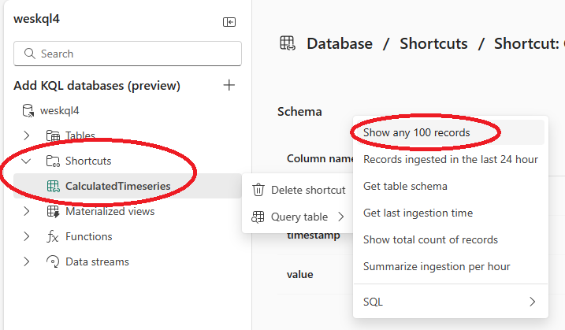

# Syncing data between Fabric Lakehouse and Fabric KQL

## Backgroud

The CDF Fabric Replicator copies data into a [Fabric Lakehouse](https://learn.microsoft.com/en-us/fabric/data-engineering/lakehouse-overview) in [Delta Lake](https://delta.io/) format. This allows for querying data in Power Bi. However, in order to use [Real-Time Analytics](https://learn.microsoft.com/en-us/fabric/real-time-analytics/overview), your data must be in a Fabric KQL database. The following instructions demonstrate how to sync data between Fabric Lakehouse and Fabric KQL.

## Prerequisites 
* Fabric workspace
* Fabric Lakehouse populated by CDF Fabric Replicator

## Setup sync
1. Open your Fabric workspace
2. Select New -> More options -> KQL Database
3. Choose a new name and press "Create"
4. Click the dropdown button next to "Get data" and select "Dataflow"

5. On the "Power Query" screen press the "Get data" button

6. On the "Get data" screen, press "OneLake data hub" and select your Lakehouse

7. On the "Choose data" screen select the table(s) that you want to sync and hit "Create"

8. On the "Power Query" screen, press the "Publish" button on the bottom, right
9. Wait a few minutes for the data to refresh, and then click on your Kql database from your workspace
10. Right click on a table (or hit the "..." when you hover over the name), choose "Query table" and "Show any 100 records"

11. Verify KQL data is populated

## (Optional) Configure sync refresh
1. Open your Fabric workspace
2. Hover over your dataflow, hit the "...", and click "Settings"
3. Expand "Refresh" and [configure scheduled refresh](https://learn.microsoft.com/en-us/power-bi/connect-data/refresh-data#configure-scheduled-refresh)